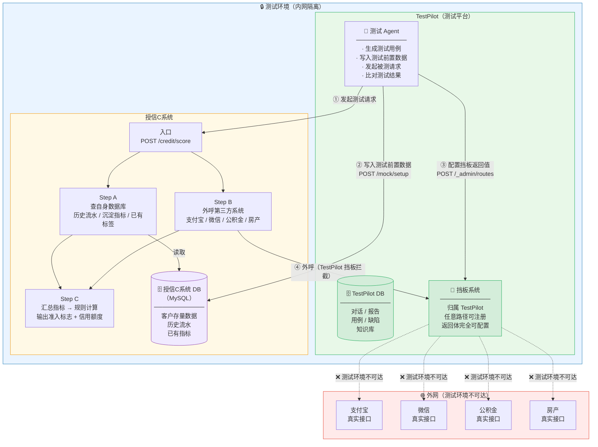
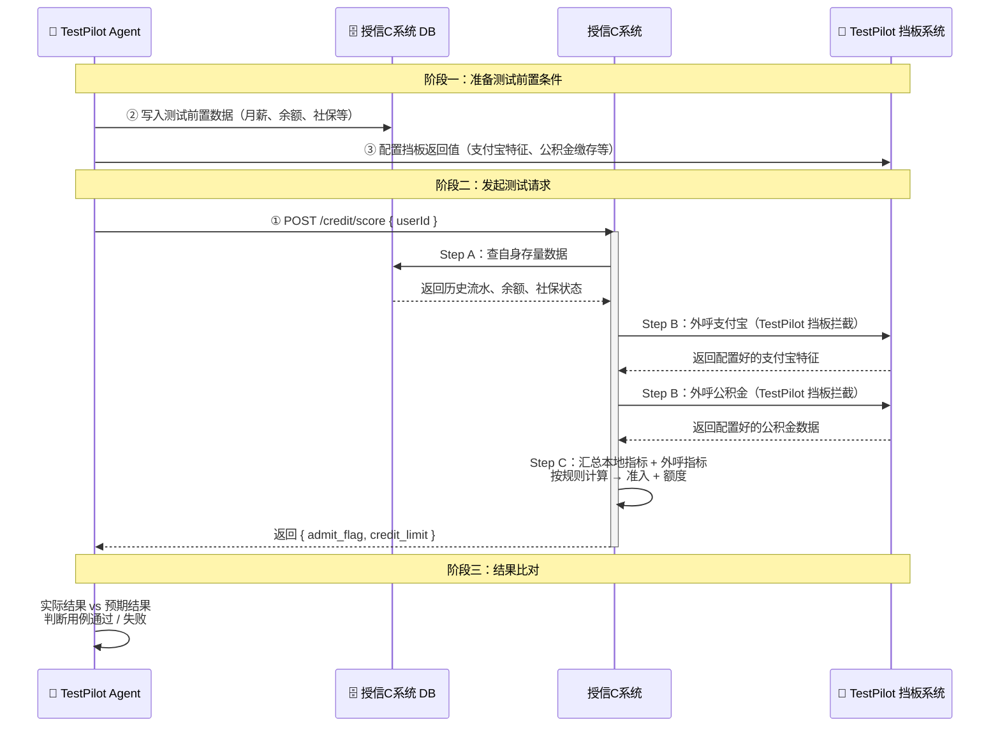
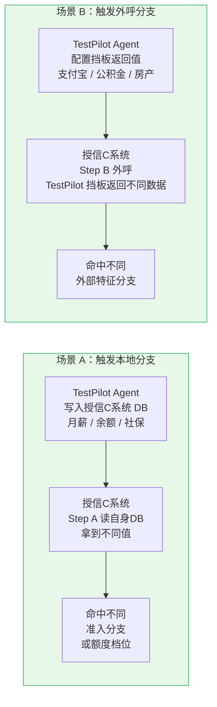
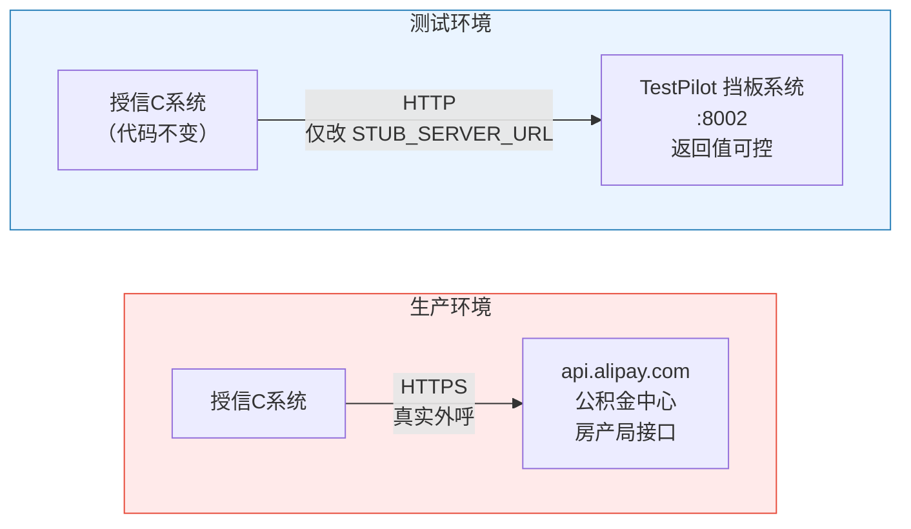

# 08 — 授信C系统测试架构组网图

> 归档用途：描述 TestPilot、授信C系统、各自数据库、外部真实三方渠道的部署位置、网络关系与调用流向。

---

## 1. 整体架构图

---

## 2. 测试流程时序图

---

## 3. 两类场景触发路径

---

## 4. 真实环境 vs 测试环境对比

> **切换点**：授信C系统配置文件中 `STUB_SERVER_URL` 指向 TestPilot 挡板地址，**授信C系统代码零修改**。生产环境改回真实外部地址即可。

---

## 5. 挡板归属说明

挡板系统（Mock Server）是 **TestPilot 的组成部分**，不属于授信C系统：

| 维度 | 说明 |
|------|------|
| 代码位置 | `TestPilot/src/stub-server/`，与 TestPilot Agent 同仓库 |
| 启动管理 | 由 TestPilot 团队负责启动、维护、配置 |
| 对授信C系统的角色 | 测试时替代真实外部三方的"假对端"，授信C系统感知不到差异 |
| 对 TestPilot 的角色 | 测试基础设施，Agent 通过 `/_admin` 接口控制其返回内容 |
| 生产环境 | **不存在**，授信C系统直接外呼真实三方 |

---

## 6. 部署位置一览

| 组件 | 所属系统 | 网络位置 | 端口 |
|------|----------|----------|------|
| TestPilot Agent | TestPilot | 内网 | — |
| TestPilot DB | TestPilot | 内网 | 5432 |
| TestPilot 挡板系统 | TestPilot | 内网 | 8002 |
| 授信C系统 | 授信C系统 | 内网 | 8000 |
| 授信C系统 DB | 授信C系统 | 内网 | 3306（MySQL） |
| 真实外部三方接口 | 外网 | 外网 | — （测试不可达） |

> **两个系统，各自职责：**
> - **TestPilot**：测试平台，包含 Agent、TestPilot DB、挡板系统三个组件
> - **授信C系统**：被测系统，包含业务逻辑和授信C系统 DB，测试时把外呼地址指向 TestPilot 挡板
