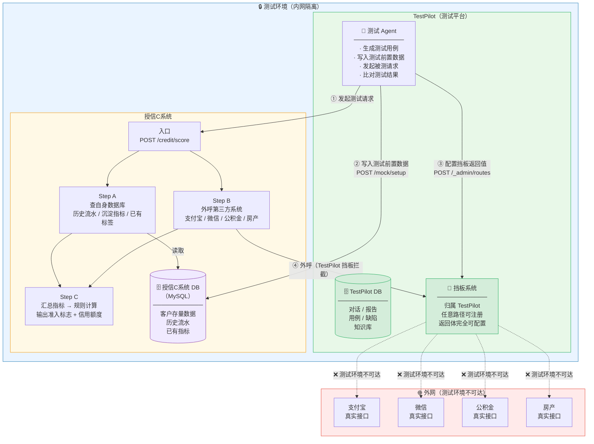
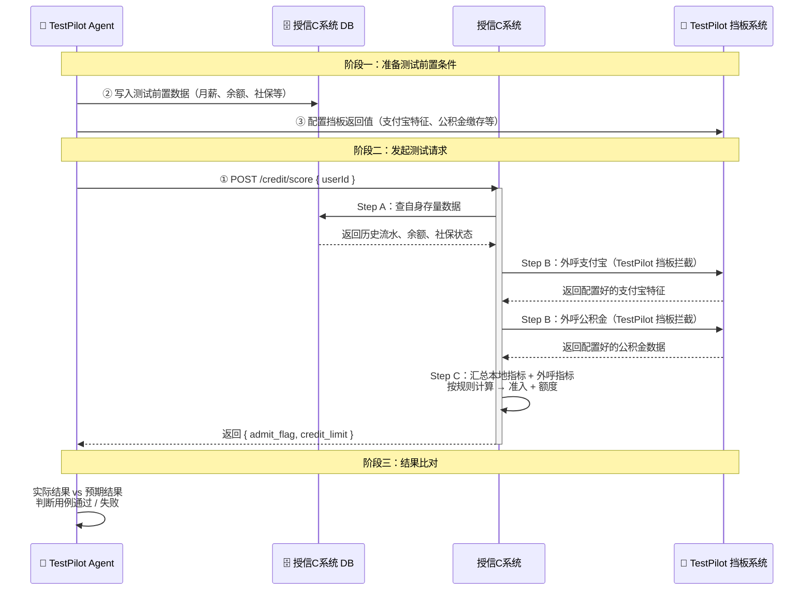
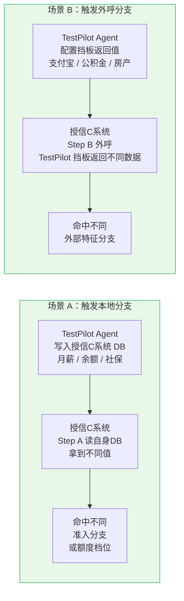
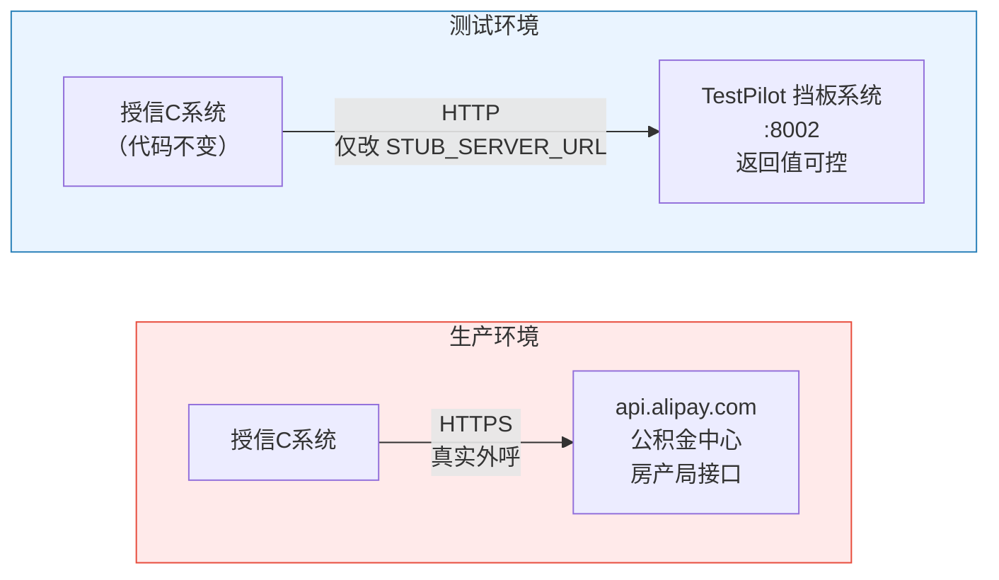
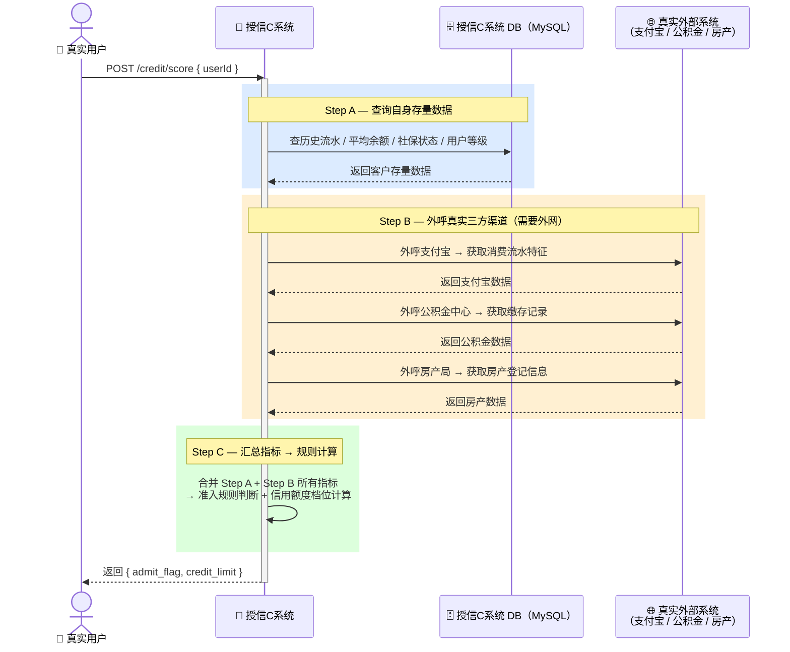
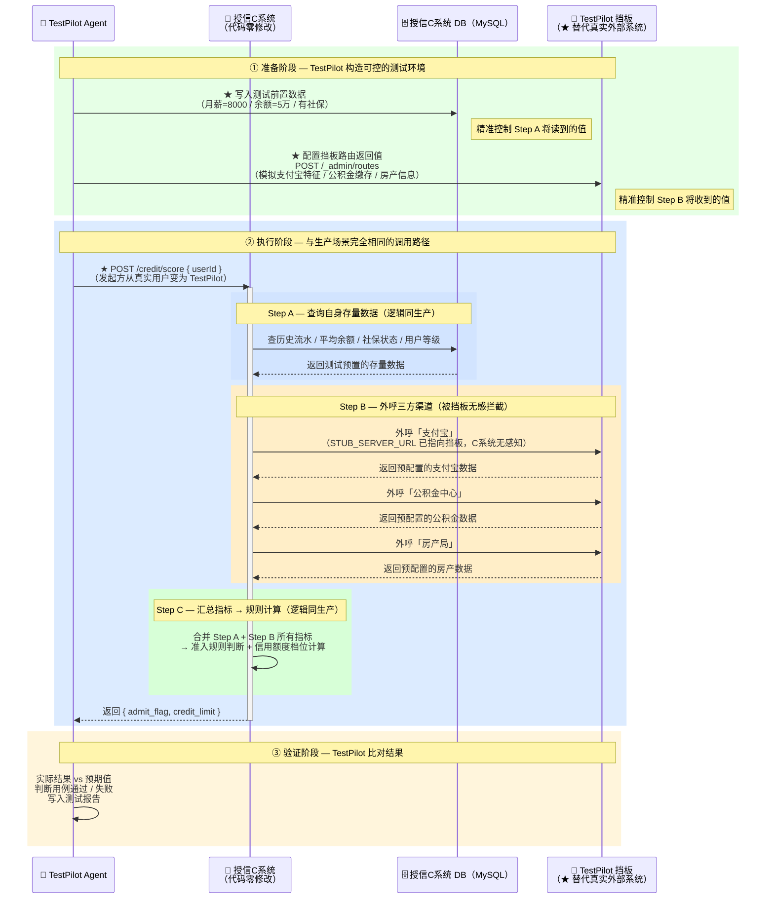

# 08 — 授信C系统测试架构组网图

> 归档用途：描述 TestPilot、授信C系统、各自数据库、外部真实三方渠道的部署位置、网络关系与调用流向。

---

## 1. 整体架构图

---

## 2. 测试流程时序图

---

## 3. 两类场景触发路径

---

## 4. 真实环境 vs 测试环境对比

> **切换点**：授信C系统配置文件中 `STUB_SERVER_URL` 指向 TestPilot 挡板地址，**授信C系统代码零修改**。生产环境改回真实外部地址即可。

---

## 5. 挡板归属说明

挡板系统（Mock Server）是 **TestPilot 的组成部分**，不属于授信C系统：

| 维度 | 说明 |
|------|------|
| 代码位置 | `TestPilot/src/stub-server/`，与 TestPilot Agent 同仓库 |
| 启动管理 | 由 TestPilot 团队负责启动、维护、配置 |
| 对授信C系统的角色 | 测试时替代真实外部三方的"假对端"，授信C系统感知不到差异 |
| 对 TestPilot 的角色 | 测试基础设施，Agent 通过 `/_admin` 接口控制其返回内容 |
| 生产环境 | **不存在**，授信C系统直接外呼真实三方 |

---

## 6. 部署位置一览

| 组件 | 所属系统 | 网络位置 | 端口 |
|------|----------|----------|------|
| TestPilot 后端（含内置 mock） | TestPilot | 内网 | 8000 |
| TestPilot DB（PostgreSQL） | TestPilot | 内网 | 5432 |
| TestPilot 挡板系统 | TestPilot | 内网 | 8002 |
| 授信C系统 | 授信C系统 | 内网 | 由被测方配置（独立部署） |
| 授信C系统 DB（MySQL） | 授信C系统 | 内网 | 3306 |
| 真实外部三方接口 | 外网 | 外网 | — （测试环境不可达） |

> **两个系统，各自职责：**
> - **TestPilot**：测试平台，包含后端服务（:8000）、TestPilot DB（PostgreSQL :5432）、挡板系统（:8002）三个组件。后端内置 mock 模块（路径 `/mock`）用于开发自测，模拟授信C系统行为。
> - **授信C系统**：被测系统，独立部署，有自己的业务逻辑和 MySQL 数据库。测试时，把 `STUB_SERVER_URL` 配置指向 TestPilot 挡板（:8002），**授信C系统代码零修改**。

---

## 7. 两种场景时序图对比

> 两图对比的核心：**授信C系统的代码、接口、内部逻辑全程不变**。TestPilot 做的是替换"输入来源"——把不可控的真实数据换成可精确控制的测试数据。

---

### 场景 A — 生产正常场景（真实用户发起）

---

### 场景 B — TestPilot 测试场景（Agent 接管，挡板替换外呼）

> 三处关键变化已用 ★ 标注；授信C系统内部 Step A / B / C 的逻辑与场景 A 完全一致。

---

### 两场景关键对比

| 维度 | 场景 A（生产） | 场景 B（TestPilot 测试） | 是否变化 |
|------|-------------|----------------------|---------|
| **发起方** | 真实用户 | TestPilot Agent | ★ 变了 |
| **Step A 数据来源** | 客户真实历史数据 | Agent 提前写入的测试数据 | ★ 变了 |
| **Step B 外呼目标** | 真实外部系统（外网） | TestPilot 挡板（内网，可控） | ★ 变了 |
| **授信C系统接口** | POST /credit/score | POST /credit/score | 不变 |
| **授信C系统代码** | 原始代码 | 原始代码（零修改） | 不变 |
| **Step A / B / C 逻辑** | 原始业务规则 | 原始业务规则 | 不变 |
| **返回结构** | { admit_flag, credit_limit } | { admit_flag, credit_limit } | 不变 |

> **一句话总结**：TestPilot 把"不可控的真实世界"替换成"完全可控的测试环境"，而授信C系统本身感知不到任何差异。
