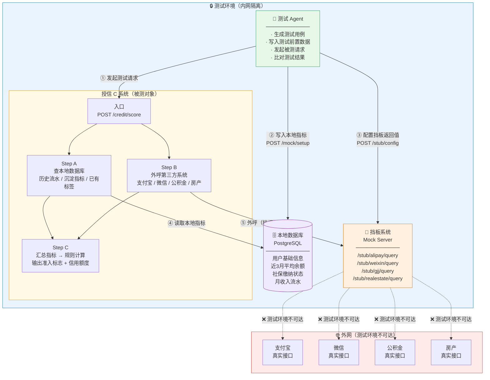
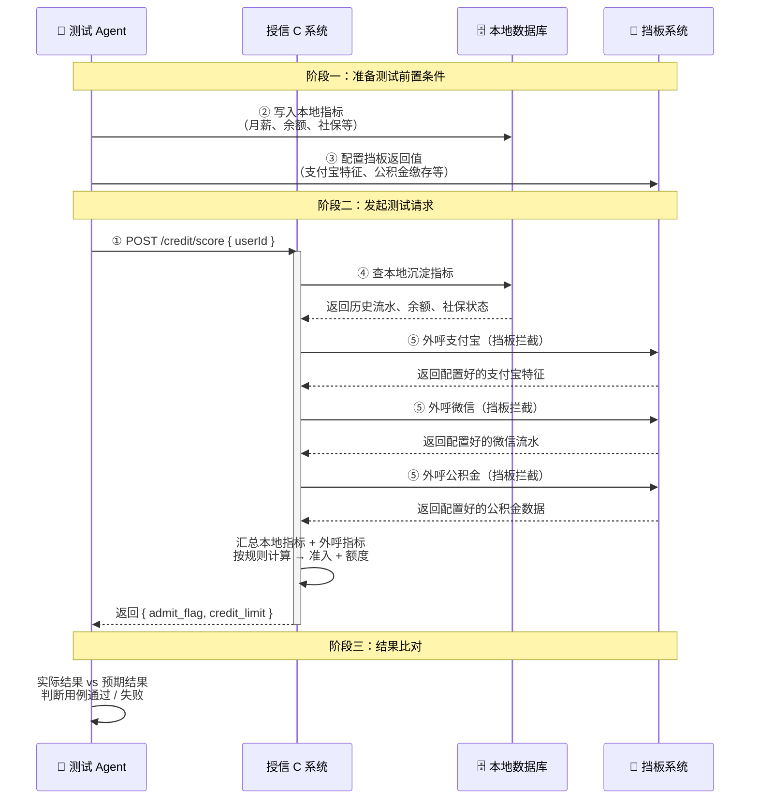
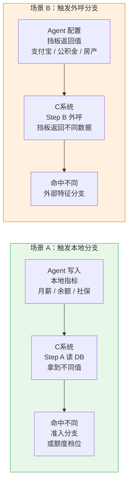
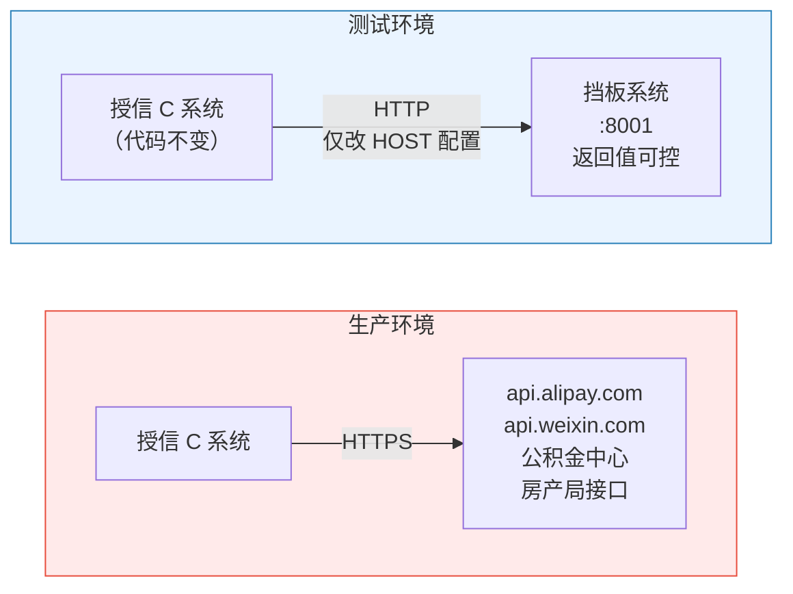

# 08 — 授信 C 系统测试架构组网图

> 归档用途：描述测试 Agent、挡板系统、授信 C 系统、本地数据库、外部真实三方渠道的部署位置、网络关系与调用流向。

---

## 1. 整体架构图

---

## 2. 测试流程图

---

## 3. 两类场景触发路径

---

## 4. 真实环境 vs 测试环境对比

> 切换点：C 系统配置文件中 `THIRD_PARTY_BASE_URL` 指向挡板地址，**C 系统代码零修改**。

---

## 5. 部署位置一览

| 组件 | 网络位置 | 端口 |
|------|----------|------|
| 测试 Agent | 内网 | — |
| 授信 C 系统 | 内网 | 8000 |
| 本地数据库（PostgreSQL） | 内网 | 5432 |
| 挡板系统（Mock Server） | 内网 | 8001 |
| 真实外部三方接口 | 外网 | — （测试不可达） |
